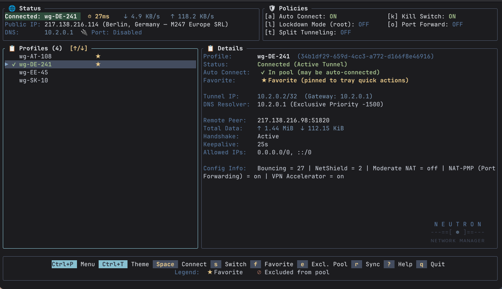
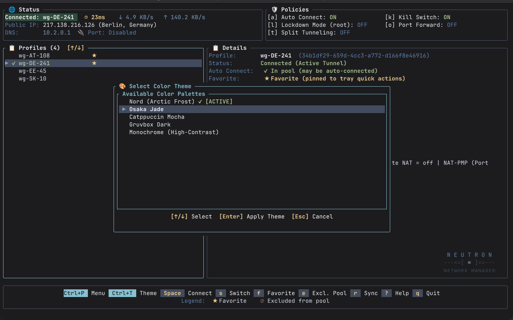
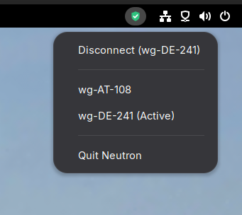

# Usage Guide (TUI & CLI)

Neutron provides both an interactive, full-featured Terminal User Interface (TUI) and a comprehensive, scriptable Command-Line Interface (CLI).

---

## 1. Interactive Terminal User Interface (TUI)

The TUI is the primary, most user-friendly way to interact with Neutron. It provides real-time telemetry, zero-latency profile browsing, interactive security toggles, and live configuration management.

### Starting the TUI

Launch the TUI simply by running:

```bash
neutron
# or explicitly:
neutron tui
```



### TUI Screen Layout

* **Header (Top):**
  * **Status Panel:** Live active profile, connection indicator, public IP, ping latency, download/upload throughput rates (`/proc/net/dev`), and active NAT-PMP forwarded port.
  * **Policies Panel:** Real-time status pills for Kill Switch, Lockdown Firewall, Split Tunneling, Port Forwarding, and Auto-Connect at login.
* **Main Body:**
  * **Left (Profile Browser):** Lists all NetworkManager WireGuard profiles with active checkmarks (`●`), favorite stars (`★`), and pool exclusion badges (`⊘`).
  * **Right (Details Pane):** Full connection diagnostics including remote peer endpoint, allowed IPs, latest handshake age, cumulative RX/TX transfer counters, persistent keepalive, and assigned interface IP.
* **Footer:** Quick keybinding shortcuts and status messages.

---

### TUI Keybindings

Every action below is also searchable by name from the **Command Palette** (`Ctrl+P` or `:`).

| Key | Action | Description |
| :--- | :--- | :--- |
| `↑` / `↓` (or `p` / `n`) | **Navigate** | Move cursor up / down through the profile list |
| `Space` / `Enter` | **Connect / Disconnect** | Connect to the selected profile, or disconnect if already active |
| `s` | **Switch Profile** | Instantly switch active tunnel to the selected profile |
| `f` | **Toggle Favorite** | Star/unstar profile for quick tray indicator access |
| `e` | **Toggle Eligibility Pool** | Include or exclude selected profile from random boot connection pool |
| `a` | **Auto-Connect at Login** | Toggle automated random profile connection on login |
| `t` | **Split Tunneling** | Open interactive Split Tunneling manager (Domains & Subnets) |
| `k` | **Kill Switch** | Toggle NetworkManager-native routing kill switch |
| `l` | **Lockdown Mode** | Toggle always-on Netfilter firewall (requires `pkexec` root) |
| `o` | **Port Forwarding** | Toggle NAT-PMP dynamic port leasing and renewal |
| `r` | **Sync Drop Directory** | Scan `~/.config/neutron/profiles/` and batch-import new `.conf` files |
| `d` / `Delete` | **Delete Profile** | Permanently remove selected profile from NetworkManager (with confirmation) |
| `Ctrl+P` / `:` | **Command Palette** | Searchable fuzzy popup for all commands and actions |
| `Ctrl+T` | **Theme Picker** | Switch themes live (`nord`, `osaka-jade`, `catppuccin`, `gruvbox`, `monochrome`) |
| `?` / `h` | **Help** | Display keybindings help modal |
| `q` / `Esc` | **Quit** | Exit the TUI cleanly |

---

### Interactive Split Tunneling (`t`)

Pressing **`t`** opens the side-by-side Split Tunneling manager:

* **Mode Selector (Top):** Use `←` / `→` to move between `[ Disabled ]`, `[ Include ]`, and `[ Exclude ]`, and `Space`/`Enter` to activate.
* **Domains (Left Column):** Type a domain (e.g. `github.com`) into the `+ Add Domain` box and press `Enter`.
* **Subnets / CIDRs (Right Column):** Type an IPv4/IPv6 CIDR (e.g. `10.0.0.0/8` or `192.168.1.0/24`) and press `Enter`.
* **Navigation:** `Tab` cycles between Mode, Domains, and Subnets. Arrow keys (`←`, `→`, `↑`, `↓`) navigate between panels and list items.
* **Deletion:** Select any entry in the list and press `Del` or `x`.
* **Automatic Non-Blocking Apply:** All changes apply and persist immediately in the background without freezing the UI.
* **Lockdown Notice:** If the Lockdown Firewall is active, a clear banner reminds you that all non-tunnel traffic is dropped when disconnected.

---

### Command Palette (`Ctrl+P` or `:`)

Press **`Ctrl+P`** or **`:`** to open the Command Palette. Type any keyword (e.g. "kill", "split", "theme", "sync") to filter actions, then press `Enter` to execute.

---

### Theme Picker (`Ctrl+T`)

Press **`Ctrl+T`** to switch between calibrated color palettes live without restarting the app:



---

## 2. Command Line Interface (CLI)

All operations can also be run directly from terminal commands or shell scripts.

### Profile Connections & Status

```bash
# List all WireGuard profiles with active status and eligibility
neutron list

# Connect to a profile by name or UUID
neutron connect "Home-Server"

# Switch connection directly to another profile
neutron switch "Work-VPN"

# Disconnect active tunnel
neutron disconnect
```

### Profile Ingestion & Drop Directory

```bash
# Batch-import new or updated *.conf files from ~/.config/neutron/profiles/
neutron sync

# Manage random-on-boot eligibility pool
neutron eligible list
neutron eligible add "Home-Server"
neutron eligible remove "Test-Server"
```

### Global Split Tunneling

```bash
# Check current split tunneling status and active routes
neutron split-tunnel status

# Set routing mode
neutron split-tunnel set-mode include
neutron split-tunnel set-mode exclude
neutron split-tunnel set-mode disabled

# Add destination subnets or domains
neutron split-tunnel add-cidr 10.0.0.0/8
neutron split-tunnel add-cidr 192.168.1.0/24
neutron split-tunnel add-domain internal.corp
neutron split-tunnel add-domain gitlab.company.com

# Remove destinations
neutron split-tunnel remove-cidr 10.0.0.0/8
neutron split-tunnel remove-domain internal.corp

# Clear all split tunnel routes
neutron split-tunnel clear
```

### Security & Firewalls

```bash
# Inspect or toggle NetworkManager-native routing kill switch
neutron kill-switch status
neutron kill-switch enable
neutron kill-switch disable

# Inspect or toggle always-on Netfilter lockdown firewall (requires polkit/pkexec)
neutron lockdown status
neutron lockdown enable
neutron lockdown disable
```

### NAT-PMP & qBittorrent Dynamic Port Sync

```bash
# Check qBittorrent integration status, WebUI connectivity, and active ports
neutron qbit status

# Test connection to qBittorrent WebUI
neutron qbit test

# Immediately sync active NAT-PMP port to qBittorrent
neutron qbit sync

# Enable / disable automated sync
neutron qbit enable
neutron qbit disable

# Configure WebUI connection parameters
neutron qbit config --url http://127.0.0.1:8080 --bind true
```

### System Tray AppIndicator & Background Daemon

Neutron includes a pure-Rust D-Bus `StatusNotifierItem` and `DBusMenu` system tray indicator (`src/service/indicator.rs` via `zbus`) that monitors link health and provides quick desktop controls:



```bash
# Run persistent D-Bus system tray AppIndicator daemon
neutron indicator

# Terminate running background instances and launch fresh session
neutron restart

# Run one-shot random profile connection (used by boot/login automation)
neutron startup-random
```
